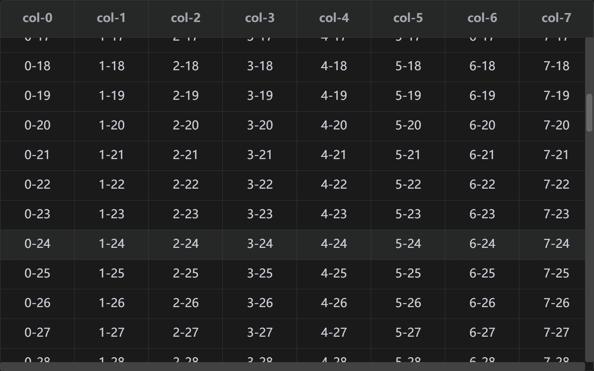

# lmh-table

> 大数据量表格数据渲染的解决方案
>
> 实测可以支持十万级别数据渲染

### ScreenShot:



#### Installation:

```shell
npm install lmh-table
```

#### Usage:

1、你需要创建一个宿主节点

```html
<div id="l-table"></div>
```

2、定义表头

```typescript
import { setUpTable } from "../core/index";

let mockColumn = Array.from({ length: 9 }).map((_, i) => ({
  title: `col-${i}`,
  prop: `col${i}`,
}));

const tableInstance = setUpTable("#l-table", {
  column: mockColumn,
  columnH: 50,
});
```

3、添加数据

```typescript
let data = Array.from({ length: 100 }).map((_, y) => {
  let obj: anyObj = {};
  mockData.forEach(({ prop }, x) => {
    obj[prop] = `${x}-${y}`;
  });
  return obj;
});

tbInstance.data = data;
```

#### Configration：

1. `setupTable`

   Parameters:

   - `dom`: 宿主dom或者宿主id / class, Type：HTMLElement | string
   - `options`

   | 名称             | 类型           | 说明         |
   | ---------------- | -------------- | ------------ |
   | column           | ItableColumn[] | 表头配置     |
   | columnH          | number         | 表头高度     |
   | headerBackground | stirng         | 表头背景颜色 |

   - `options.column` 
   
     ItableColumn
   
   | 名称  | 类型   | 说明   |
   | ----- | ------ | ------ |
   | title | string | 标题   |
   | prop  | string | 标识   |
   | width | number | 列宽度 |
   
   


