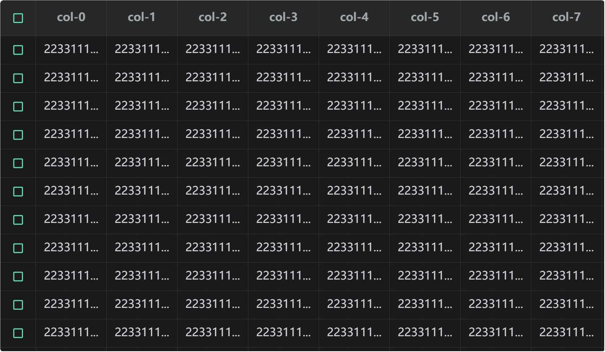

# lmh-table

> 大数据量表格数据渲染的解决方案
>
> 实测可以支持十万级别数据渲染

### ScreenShot:



#### Installation:

```shell
npm install lmh-table
```

#### Usage:

1、你需要自行创建一个 canvas 节点

```html
<canvas id="l-table"></canvas>
```

2、定义表头

```typescript
import { setUpTable } from "../core/index";

let mockColumn = Array.from({ length: 9 }).map((_, i) => ({
  title: `col-${i}`,
  prop: `col${i}`,
}));

const tableInstance = setUpTable("#l-table", {
  column: mockColumn,
  columnH: 50,
});
```

3、添加数据

```typescript
let data = Array.from({ length: 100 }).map((_, y) => {
  let obj: anyObj = {};
  mockData.forEach(({ prop }, x) => {
    obj[prop] = `${x}-${y}`;
  });
  return obj;
});

tbInstance.data = data;
```
